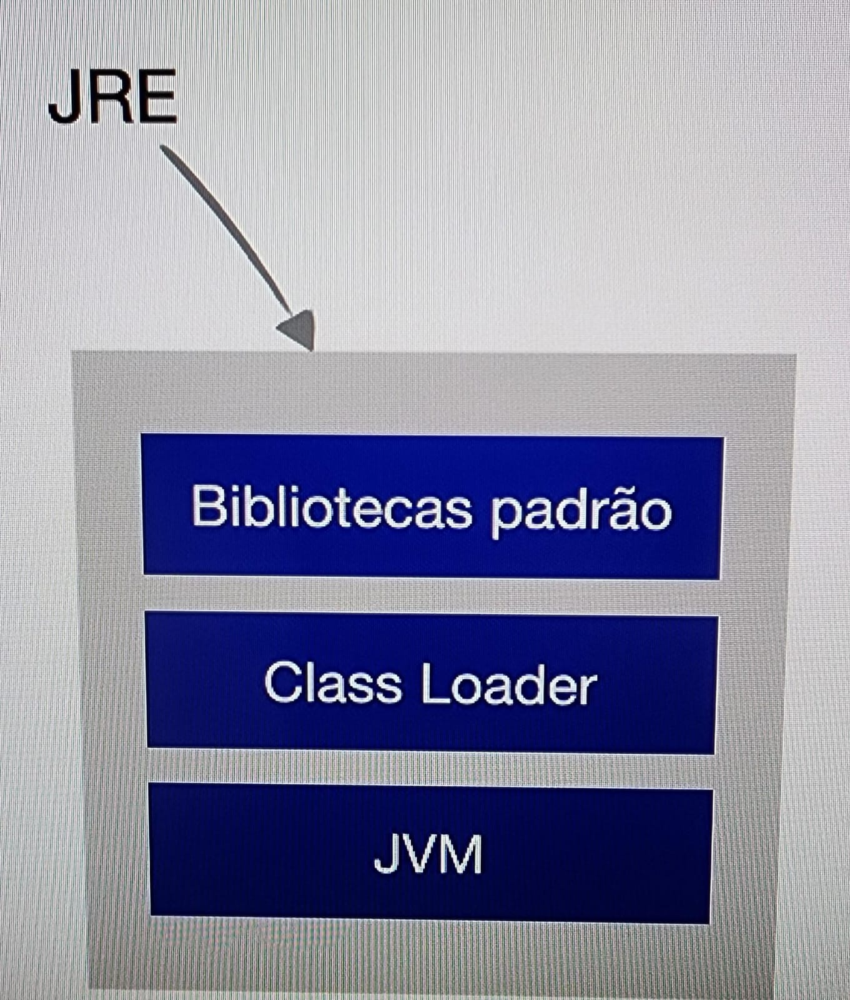
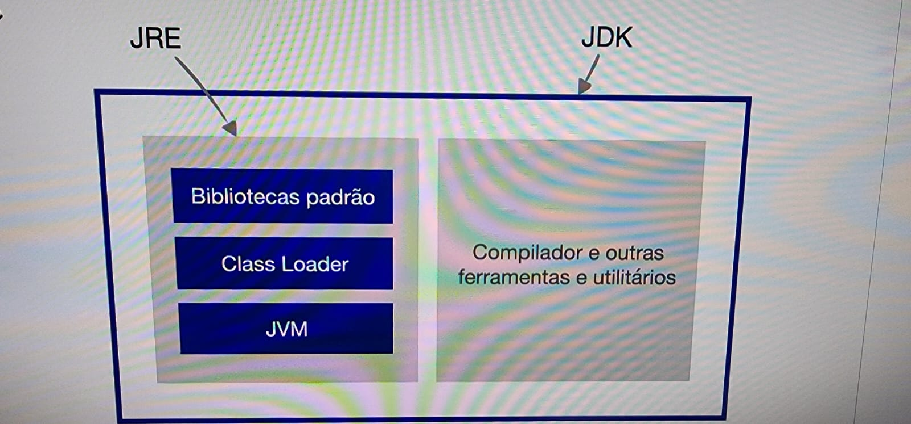

# Plataformas Java, JVM, JDK e JRE

## a) Plataformas Java

Plataformas Java oferecem recursos para ajudar no desenvolvimento. Por exemplo:

1. **Java SE (Standard Edition)**
    - Oferece recursos como: Threads, Streams, Collections, JDBC, Swing, JavaFX.
    - **Exemplos de uso:** Aplicações desktop, ferramentas CLI, sistemas internos.

2. **Java EE (Jakarta EE - Enterprise Edition)**
    - Focada no desenvolvimento de aplicações empresariais escaláveis.
    - Estende o Java SE com: Servlets, EJB, JPA, CDI, JAX-RS e outros.
    - **Exemplos de uso:** Sistemas bancários, ERPs, portais corporativos.

---

## b) Java Virtual Machine (JVM)

Java é uma linguagem **pré-compilada**. Para transformarmos o código em uma linguagem binária compreensível pela máquina, precisamos da **JVM** instalada.

Quando compilamos um código Java, ele gera um **Bytecode** (ex: `10101101110101010001010`) que a JVM interpreta e executa na máquina.

---

## c) JRE e JDK — Qual a diferença?

### Java Runtime Environment (JRE)

- **O que é:** Ambiente de execução Java.
- **Para que serve:** É o software necessário nos computadores que apenas irão executar os programas desenvolvidos.
- **Inclui:**
    - Bibliotecas padrão (ex: números, listas, etc.)
    - `ClassLoader` (carrega as classes Java)
    - JVM (Java Virtual Machine)
- **Usado por:** Usuários finais.

---

### Java Development Kit (JDK)

- **O que é:** Kit de desenvolvimento Java.
- **Para que serve:** Necessário para **desenvolver** programas Java.
- **Inclui:**
    - Compilador (`javac`) que transforma código fonte em bytecode
    - Ferramentas de desenvolvimento diversas
    - **Inclui o JRE**
- **Usado por:** Desenvolvedores.

---

## d) Instalação do JDK no Ubuntu e Mac

Utilizar o [SDKMAN!](https://sdkman.io/) é a maneira mais prática, pois permite:

- Instalar múltiplas versões do JDK
- Alternar facilmente entre elas
- Gerenciar versões de forma simples

---

## e) Editor de Código Simples

No início, **evite usar IDEs completas**.

Utilize um editor de texto puro, como o **Notepad**, para aprender a estruturar e compilar os programas manualmente. Isso ajuda no entendimento da linguagem e do processo de compilação.
