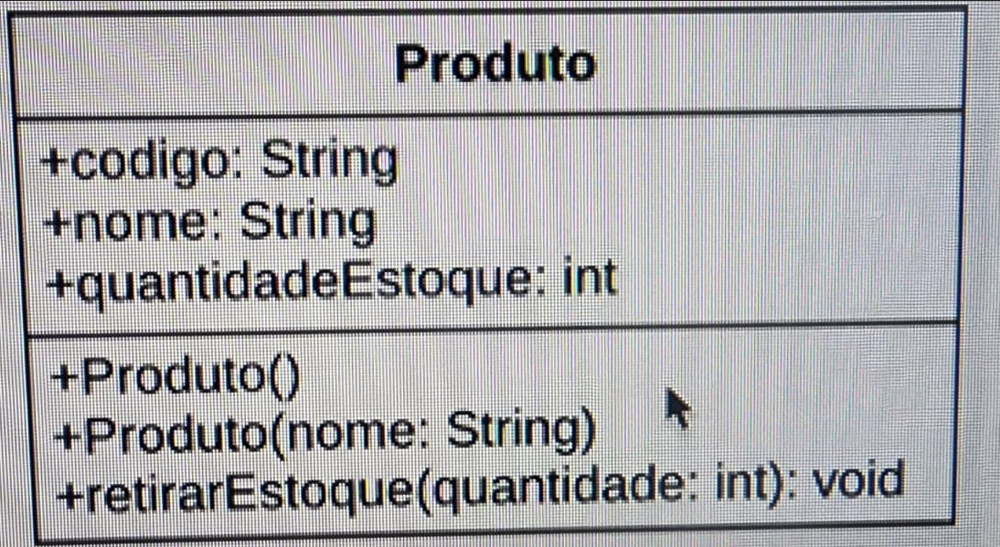
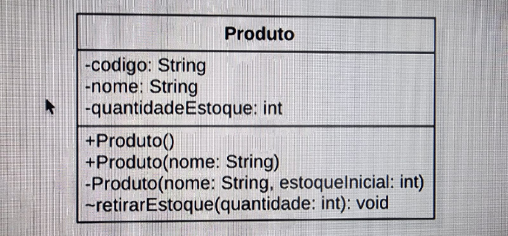

# Anotações sobre Construtores em Java

## 1) Criando e chamando construtores:

Toda classe possui um construtor. Mesmo quando não vemos, o java cria um construtor invisível que não possui parâmetros.

Quando instanciamos uma classe com `new`, estamos invocando o construtor da classe. (`new` invoca o construtor).  
Exemplo de construtor de uma classe chamada Produto:

```java
Produto produto () {
}
```

Colocamos construtor no código quando queremos garantir um estado inicial para os parametros, como por exemplo inicialização de variável.

---

## 2) Construtores com parâmetros

Construtores podem receber argumentos.  
Um exemplo é caso produto tenha nome e qtdEstoque. Se quiser que obrigatoriamente toda vez que instanciar Produto, passe ambos os parâmetros, iremos fazer:

```java
Produto produto(String nome, int qtdEstoque) {
    this.nome = nome;
    this.qtdEstoque = qtdEstoque;
}
```

Nesse caso toda vez que instanciarmos um `new Produto`, obrigatoriamente teríamos que passar ambos argumentos.  
Outro exemplo, é caso por algum motivo não seja mais necessário passar a `qtdEstoque` pois o mesmo estará alocado em uma constante... Podemos atribuir o valor direto. Exemplo:

```java
public class Produto {
    static final int QUANTIDADE_ESTOQUE_INICIAL = 10;
    String nome;
    int qtdEstoque;

    Produto(String nome) {
        this.nome = nome;
        this.qtdEstoque = QUANTIDADE_ESTOQUE_INICIAL;
    }
}
```

Dessa forma, temos controle do que é obrigatório ser passado.

---

## 3) Sobrecarga de construtores

Ocorre quando colocamos mais de um construtor com parâmetros diferentes. Em alguns casos é necessário criar mais de um construtor para a mesma classe, dependendo do que precisa.  
Lembrando que ao criar um construtor o default do java que costuma ser criado em tempo de compilação não é mais criado, então caso ainda seja necessário, lembrar de criar um construtor vazio.

```java
Produto () {
}
```

---

## 4) Boas práticas: Valide os argumentos de construtores também.

Ao usar construtores, é uma boa prática validar os campos que ele recebe, para que não seja possível passar algo que não faça sentido. Por exemplo, setar o nome null ou o qtdEstoque negativo.  
Uma sugestão, seria usar a própria classe `Objects` para validar se o campo vem nulo, por exemplo, dentro do construtor:

```java
Objects.requireNonNull(nome, "nome nao pode ser nulo");
```

Ou `if` com exception:

```java
if(estoque < 0){
    throw new Excepti.......
}
```

Porém, nesse caso, se a validação foi feita via construtor e ele não permitir, nada impede de setarmos direto no objeto depois, exemplo:

```java
Produto produto1 = new Produto("Fran", 10);
produto1.setNome = null;
produto1.setQtdEstoque = -15;
```

Esse caso funcionaria, e por isso é importante também validações nos gets e sets, mas será passado melhor em outro tópico.

---

## 5) Encadeamento de chamadas de construtores

Para evitar repetição de código, conseguimos chamar um construtor de dentro de outro constutor através do `this`.  
O único ponto é que precisa ser passado como primeira instrução. Isso evita repetir código.

```java
Produto() {
    this("Sem nome");
}

Produto(String nome) {
    this(nome, QUANTIDADE_ESTOQUE_INICIAL);
}

Produto(String nome, int estoqueInicial) {
    Objects.requireNonNull(nome, "Nome é obrigatório");

    if (estoqueInicial < 0) {
        throw new IllegalArgumentException("Estoque inicial não pode ser negativo");
    }

    this.nome = nome;
    this.quantidadeEstoque = estoqueInicial;
}
```

---

## 6) Diagrama de classes: Construtores

Construtor só tem nome da classe, sem retorno porque não é um método:

- Produto()
- Produto(nome)

  
Não precisa sempre colocar construtor em diagrama, depende do que quer. Se for diagrama só de negócio por exemplo, não faz sentido colocar.

---

## 7) Modificador `final` em variáveis de instância

Iniciando uma variável como `final`, significa que não poderá ser alterada.  
Quando criamos uma variável `final` na classe, ele obriga que seja iniciada na hora, porém existe a possibilidade de inicia-la em um construtor.

Um exemplo seria uma `String codigo`, de uma classe Produto. Ficaria:

```java
final String codigo = UUID.randomUUID.toString();
```

ou

```java
final String codigo;

Produto () {
    this.codigo = UUID.randomUUID.toString();
}
```

Em ambos os casos usei o UUID como exemplo, pois eu confundia final e inalterável com valor estático, e na verdade, final só impede reatribuição: ainda podemos atribuir valores aleatórios ou dinâmicos uma única vez, desde que do mesmo tipo.

---

*(continua nos próximos blocos devido ao limite de tokens por resposta)*


### 8) Organizando as classes em pacotes

É importante sempre organizar o projeto em packages para melhorar manutenção e orientação.  
Seguindo boas práticas de java, a partir do `src` sempre criar os packages com o domínio ao contrário,  
exemplo, site `www.java-estudo.com` viraria pacotes com `com.estudo.java` e segue o projeto.

---

### 9) Importando classes no projeto

- Quando importamos no código o caminho inteiro da classe, é chamado de _Fully qualify name_.  
  Ex: `com.estudo.java.Produto`

- Quando criamos construtores sem especificar quem pode ver, o `default` só deixa ter acesso a outras classes do mesmo pacote,  
  sendo assim, caso aquelas classes com construtores criadas antes, diretamente com o nome da classe, não seria possível ser instanciadas de outros pacotes.  
  Ou seja, quando é necessário instanciar de outro pacote, lembrar de criar construtores com visibilidade `public`.  
  Ex:
```java
public Produto() {
}
```

- Quando fazemos import geral (`*`) com asterisco, não existe problema de performance, porém é visto como má prática. Dois motivos principais:
    1. É mais fácil de visualizar de onde está vindo a classe, quando o import único está visível.
    2. Evita conflitos de quando vamos usar classes com o mesmo nome, que são de outro pacote.

- Curiosidade: `java.lang` é usado o tempo todo, mas não é necessário `import`, ele já é usado em todo código.  
  Exemplo: `String`, `Integer`, `Double`, `System.out.print`, `RuntimeException`, entre outros.

---

### 10) Modificador de acesso `public` e `default`

São modificadores de acesso, são usados em qualquer membro da classe (própria classe, métodos, variáveis, construtores).  
A boa prática é sempre deixar o mais restrito possível.  
No caso de `public` e `default`, `default` seria o mais restrito pois ele não deixa um acesso fora de outro pacote.  
No caso de `public`, já é possível acessar.  
Ou seja, deixar `public` apenas o que será acessado de fora.

---

### 11) Modificador de acesso `private`

`private` só deixa os membros serem usados dentro da própria classe.  
Obviamente não dá pra criar uma classe `private` porque não faria sentido, mas conseguimos criar `private` construtores, métodos, variáveis.  
Útil pra situações que se resolvem dentro da própria classe e que não faz sentido serem chamados em outro lugar.

---

### 12) Diagrama de classes: visibilidade `public`, `package` e `private`

Fazendo UML temos como colocar quais atributos são `public`, `private` ou `package` (que seria o `default` do java).

- `(-)` significa private
- `(~)` significa default - package
- `(+)` significa public

Obviamente se for um diagrama conceitual, de produto, não precisa se preocupar com isso.  
Colocar mais se for algo super técnico, e no caso de possibilidade de gerar o código inicial a partir dele.  
Do contrário, não precisa e fica de conhecimento adicional.

---

### 13) Uso de método e `import static`

`static`, como já vimos antes, significa que o método ou a variável é da classe, e não da instância.  
Ao criar um método `static` é possível fazer um `import static`, ou seja, ao invés de sempre precisar chamar a classe e o método, conseguimos chamar o método direto pois a classe estará importada.

Exemplo:

Ao invés de:
```java
Calculo.raizQuadrada(10, 3);
```

Ficaria:
```java
import static com.java.fran.Calculo.pi;

raizQuadrada(10, 3);
```

---

### 14) Múltiplas classes não-publicas em um único arquivo

É possível criar mais de uma classe em um arquivo, porém sempre será criada com o modificador de acesso `default`,  
do contrário não compila.  
Obrigatoriamente, a classe que for `public` tem que ser a com o mesmo nome do arquivo `.java`.

Seguindo boas práticas, quando é útil?  
Mais para exemplos, palestras, explicar algo.  
O certo é evitar usar para melhor organização do projeto.

---

### 15) Conhecendo a documentação JavaDoc do Java SE

Todo framework tem a sua documentação, e uma boa prática seria ler tudo que precisa.  
No caso de Java, temos a API Documentation, que também chamam de JavaDoc.

🔗 https://docs.oracle.com/en/java/javase/21/

Dentro da API Documentation, temos os módulos que são utilizados no Java com tudo que precisamos para o dia a dia,  
e dentro dos módulos (por exemplo o módulo `java.base`) existem vários pacotes, como `java.lang`, `util`, etc.  
Essa documentação é exatamente o que o IntelliJ busca quando usamos alguma classe do próprio Java.
