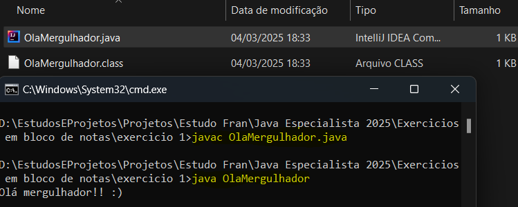
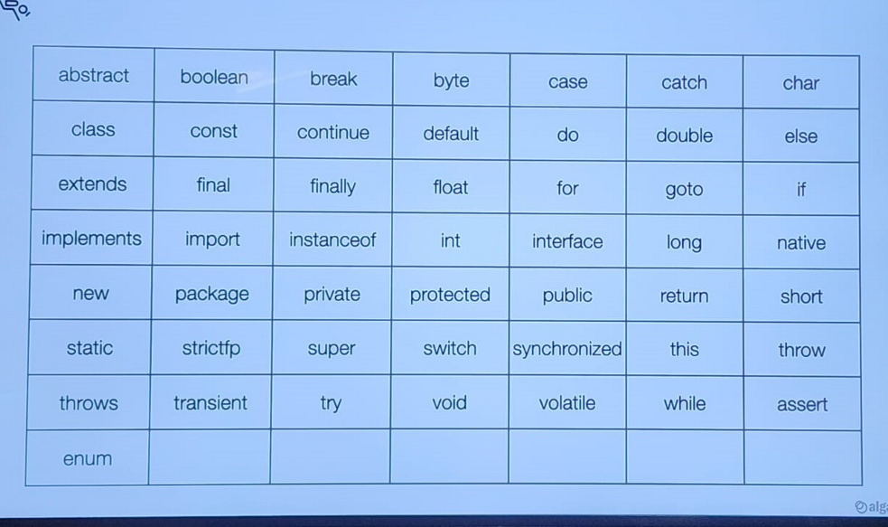
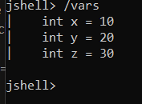
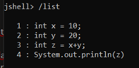
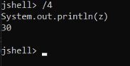

Fundamentos da linguagem java


# Introdução ao Java — Conceitos Iniciais

## a) Primeiro Programa em Java

Utilizar apenas o **bloco de notas simples**.

## b) Compilando Arquivo Java no Bloco de Notas

1. No prompt de comando, utilizar:
   ```bash
   javac NomeArquivo.java
   ```
   Isso gera um arquivo `.class` (Bytecode).

2. Para executar:
   ```bash
   java NomeArquivo
   ```

📸 *Essa ação irá compilar e executar:*  


---

## c) Convenções de Código

Existem documentações de como screver código de forma padronizada:
- Indentação
- Comentários
- Espaços em branco

> Veja: [Oracle Code Conventions](https://www.oracle.com/java/technologies/javase/codeconventions-contents.html) e [Google Java Style Guide](https://google.github.io/styleguide/javaguide.html)

---

## d) Palavras Reservadas



---

## e) Trabalhando com Variáveis

Adicionar valores à memória do computador. Nomes simbólicos dados a informações armazenadas na memória do computador.

O int pode ter undescore no número a partir do java 7 que não altera o valor.
Exemplo com underscore (Java 7+):
```java
int numero = 218_213;
```

---

## f) Casting → Conversão

Ocorre quando temos atribuir uma variável o valor de outra variável porém com tipos diferentes.

Se tiver garantia que o valor vai caber no outro, a gente faz um casting.

### Quando não compila:
```java
long x = 10;
int y = x; // Não compila!
```

Agora se lançar casting compila.
### Usando casting manual:
```java
int y = (int) x;
```

Se o tipo destino for maior do que o outro, acontece um casting automatico. Exemplo, se eu fizesse a conversão de 
long pra int, ele já aceitaria automaticamente.

---

## g) Sequências de Escape em String
Suponhamos que queira imprimir "Maria" entre aspas ou então uma localização de diretório C:\\Windows... Ou pular linha.
Pra enxergar caracteres especiais usar uma barra.
```java
System.out.println("Oi \"Maria\"");      // Oi "Maria"
System.out.println("C:\\Windows...");     // C:\Windows...
```

Para pular linha: `\n`

---

## h) Saída com `printf`
    
println significa imprimir a linha
printf signfiica formatado. %s substitui por uma String em variável. E %n é pra pular a linha usando o printf.
		
Abaixo um exemplo recebendo dois argumentos, o primeiro a String e o segundo o pulo de linha.
		
    String nome1 = "nome";
    System.out.printf("Olá, %s %n", "nome1");
		
Para numeros inteiros é %d.
Int quantidade = 48;
System.out.printf("Quantidade: %d itens%n", quantidade);
		
Para pontoi flutante.
double peso = 938.22;
System.out.printf("Peso: %f", peso); vai imprimir com 6 casas decimais por padrão. 938.220000
		
Para diminuir as casas decimais colocar o numero
System.out.printf("Peso: %.2f", peso); -> 938.22
		
Se a gente quiser no minimo uma quantidade de caracteres da pra adicionar espaços em branco a esquerda do numero.
System.out.printf("Peso: %10.2f", peso); ->          938.22

### Strings
```java
String nome1 = "nome";
System.out.printf("Olá, %s %n", nome1);
```

### Números inteiros
```java
int quantidade = 48;
System.out.printf("Quantidade: %d itens%n", quantidade);
```

### Ponto flutuante
```java
double peso = 938.22;
System.out.printf("Peso: %f", peso);         // 938.220000
System.out.printf("Peso: %.2f", peso);       // 938.22
System.out.printf("Peso: %10.2f", peso);     //      938.22
```

---

## i) Entrada de Dados com Scanner
Usar uma classe chamada Scanner.

```java
Scanner entrada = new Scanner(System.in);
String nome = entrada.nextLine();
int peso = entrada.nextInt();
double altura = entrada.nextDouble();
```

---

## j) Usando Jshell (Java 9+)

Várias linguagens de programação tem um terminal interativo para executar códigos e testar a linguagem sem precisar 
criar um arquivo e definir toda a estrutura de um programa, então a partir do java 9, temos o jshell.
Para iniciar, vá no terminal e digite jshell.

### Iniciar
```bash
jshell
```

### Comandos úteis
- `/vars` → Ver variáveis declaradas

  
- `/list` → Ver código já executado

  
- `/<número>` → Se quiser ir direto e repetir algum é só ir /numero `<número>`

- `/reset` → Limpar tudo
- `/exit` → Sair


### Exemplo de uso
```java
int x = 10;
int y = 20;
int z = x + y;
System.out.println(z); // 30
```

---
