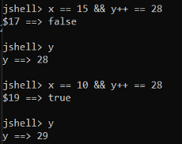
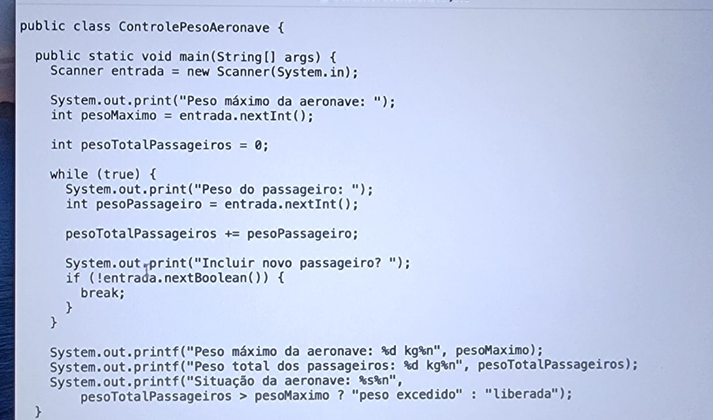

# Java — Switch, Operadores, Ternário e Loops

## a) Comparação de Strings

Cuidado ao comparar Strings com `==` ou `!=`. Existem casos que não funcionam.

---

## b) Operadores de curto circuito

Operadores de curto circuito é como são conhecidos `||` e `&&`.

Refrescando a memória de pós fixado e pré fixado. Quando colocamos o fixo depois, ele lê primeiro a variável e compara com o valor, somente depois ele incrementa.  
Quando colocamos o fixo antes, ele soma mais 1 e dá falso, pois Y fica como 21oie.

📸 *Exemplo:*  


---

## c) If

No if, declarar variável fora do if, do contrário não funciona.

---

## d) Switch case

```java
int nota;
String descricaoNota;

switch (nota) {
    case 1:
        descricaoNota = "Muito ruim";
    case 2:
        descricaoNota = "Ruim";
    case 3:
        descricaoNota = "Razoável";
    case 4:
        descricaoNota = "Muito bom";
    case 5:
        descricaoNota = "Excelente";
    default:
        descricaoNota = "Opção inválida";
}
```

Enum funciona, String funciona, int funciona, char, byte, short, double funcionam. **long NÃO funciona.**

Dessa forma acima, ele sempre imprime **Opção inválida**, porque ao digitar por exemplo o número 2 na entrada, ele tem o case 2 como verdadeiro e executa todos os de baixo. Como o default está por último, ele acaba exibindo ele.

### COMO FAZER COM QUE APENAS O CASO CORRESPONDENTE SEJA EXECUTADO?
Com um break!

```java
switch (nota) {
    case 1:
        descricaoNota = "Muito ruim";
        break;
    case 2:
        descricaoNota = "Ruim";
        break;
    case 3:
        descricaoNota = "Razoável";
        break;
    case 4:
        descricaoNota = "Muito bom";
        break;
    case 5:
        descricaoNota = "Excelente";
        break;
    default:
        descricaoNota = "Opção inválida";
}
```

Faz sentido não usar o break quando tem algumas condições iguais.  
Por exemplo, em um caso onde um local feche de segundas-feiras e abra de terça a sexta. Dá pra colocar:

```java
switch (diaSemana) {
    case "seg":
        horarioFuncionamento = "Fechado";
        break;
    case "ter":
    case "qua":
    case "qui":
    case "sex":
        horarioFuncionamento = "08:00 às 18:00";
        break;
}
```

Dessa forma ele irá imprimir no caso de terça a sexta a mensagem de sexta.

---

## e) Formas melhores de utilização

A partir do Java 14 foi lançada uma mudança no switch que talvez faça ele começar a ser mais utilizado.  
Passou a existir uma nova fórmula de rotular o switch com arrow case.

Não é mais necessário o break e é necessário colocar vários casos separados por vírgula:

```java
switch (diaSemana) {
    case "seg" -> horarioFuncionamento = "Fechado";
    case "ter", "qua", "qui", "sex" ->  horarioFuncionamento = "08:00 às 18:00";
    default -> horarioFuncionamento = "Dia inválido";
}
```

Também a partir do Java 14 podemos usar **switch expression**, atribuindo o resultado em uma variável.  
Ou seja, você só coloca o valor do lado direito que vai atribuído à variável do switch.

Ao utilizar o switch expressions você obrigatoriamente precisa colocar um `default` ou cobrir todas as possibilidades.

```java
String horarioFuncionamento = switch (diaSemana) {
    case "seg" -> "Fechado";
    case "ter", "qua", "qui", "sex" -> "08:00 às 18:00";
    default -> "Dia inválido";
};
```

---

## f) Operador Ternário!

Ternário.

```java
if(tipoNotaFiscal == 'S') {
    valorImpostos = totalFaturado * 0.16;
} else {
    valorImpostos = totalFaturado * 0.35;
}
```

Passa a ser:

```java
double valorImpostos = tipoNotaFiscal == 'S' ? totalFaturado * 0.16 : totalFaturado * 0.35;
```

---

## g) Loops — For

```java
for ( iniciação; condição; incremento ou decremento ) {
}

for ( int i = 1 ;  i <= 10; i++) {
}
```

---

## h) While

```java
while () {
}
```

---

## i) Break

Existem também como sair do laço a partir do break.


---

## j) Do While

Existe também o `do while`.
