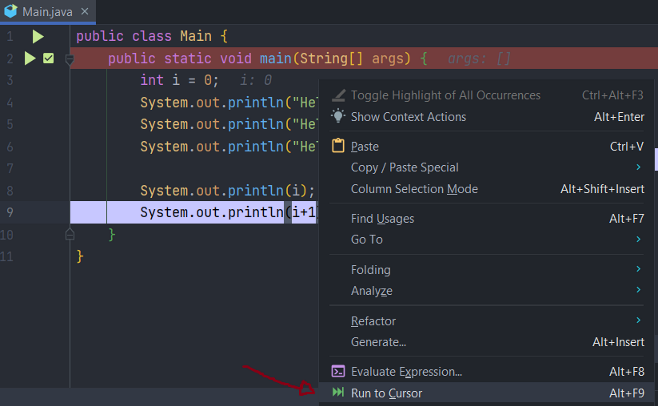
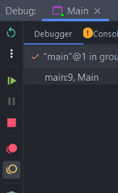
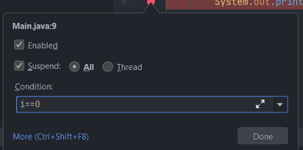
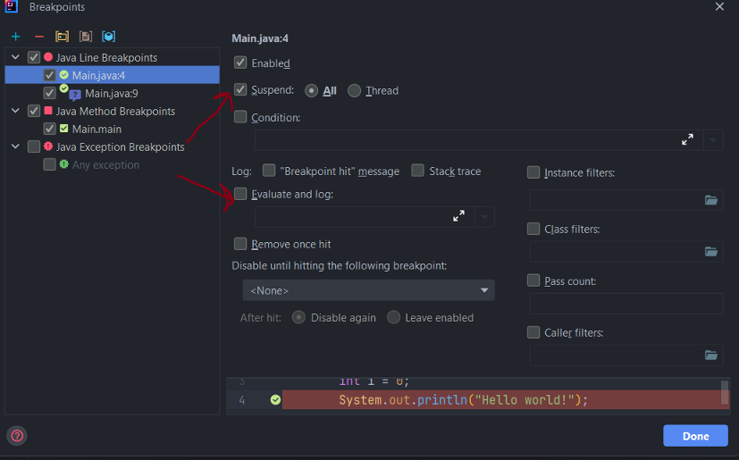
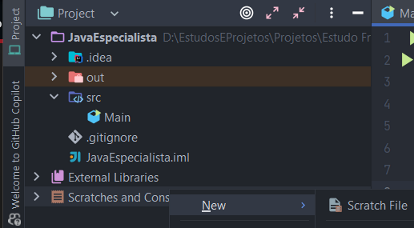
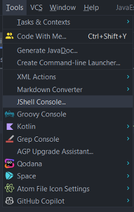
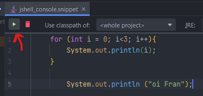
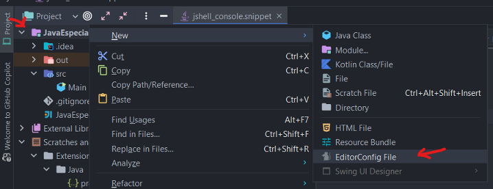

# IntelliJ IDEA — Dicas, Debug, Postfix, Snippets e Padronização

## a) Shared Index para computadores lentos

Em computadores muito lentos, podemos deixar ativado o shared index para baixar o que é necessário da JDK e Maven automaticamente e mais rápido.  
Precisa ativar no **Tools** na configuração e instalar um plugin que é pago.

---

## b) Cancelar o complemento do código automático

Vá em:  
**Configuração → Editor → General → Code Completion**, e desmarque a opção:  
**"Show suggestions as you type"**.

Dessa forma, só irá aparecer se você quiser com `Ctrl + Espaço`.

---

## c) Live Templates

São as palavras chaves que já colocam código pra você.

Exemplo: ao digitar `"main"` ele sugere já montar toda a classe.  
O `"sout"` vira `System.out.println`.  
O `"fori"` já cria um `for` automático.

Dá pra customizar live templates também, em:  
**Configurações → Live Templates**.

---

## d) Postfix Completion

Ajuda a evitar que fique voltando o cursor pra completar um pedaço de código.  
Pode transformar o que digitou em uma diferente...

Por exemplo, se eu quiser imprimir uma variável e escrevo direto ela:

```java
int total = 10;
```

Consigo fazer:

```java
total.sout
```

Isso vai fazer ele transformar em um `System.out.println(total);`.

Se quiser fazer um `if` de total:

```java
total.if
```

Agora laço com `while` enquanto total for verdadeiro:

```java
total.while
```

Ou:

```java
total.fori
```

Também dá pra editar os Postfix Completion.

---

## e) Atalhos

Dentro de **Help**, tem um **Keyboard Shortcut** com atalhos de teclados da IDE.

- `Ctrl + Alt + R` → Faz pesquisa e replace.  
  Exemplo: alterar tudo que tá escrito `"teste"` para outra coisa (substitui).

---

## f) Debug

- `Ctrl + F8` → Coloca o debug ou tira.
- **Run to cursor** faz o debug ir direto pra linha que quer, mesmo se não tiver colocado um break point.

📸 Exemplo:  


### § Debugger → Silenciamento, condição e desativação de breakpoints

- **Mute breakpoints**: se marcar a bolinha abaixo, os breakpoints ficarão mutados e não vão parar no breakpoint.
  

- Dando botão direito na bolinha do breakpoint, é possível criar uma **condição** pra quando ele deve parar.
  
### § Debugger: Gerenciando variáveis e avaliando expressões

- Alterar valores de variáveis em tempo de debug. Existe o `Evaluate Expression`.  
  Tem algumas formas de fazer isso.  
  A primeira é: na aba Debugger existe uma aba de variável que pode trocar.

### § Debugger: Watches e Logging

- Além de alterar o valor, dá pra adicionar **watches** pelo Evaluate que vai observar caso alguma condição aconteça.
  
- Também tem como colocar **mensagem de log**:
    - Botão direito na bolinha do debug
    - `More`
    - Fazer a configuração

Pode ou só fazer a mensagem de log, ou deixar a seleção do `Suspend`, ou deixar no suspend mesmo e ter um debug normal.

---

## § Scratch Files

- Tem na parte de baixo da IDE. Dá pra criar arquivos rascunhos dentro dele. (Só lembrar de adicionar no `.
  gitignore` pra não subir junto.)




---

## § Snippets com JShell

- Dá pra criar snippet pra usar JShell indo em **Tools → JShell**.

  
  
📸 Exemplo de uso:
```java
for (int i = 0; i<3; i++) {
    System.out.println(i);
}
System.out.println("Oi Fran!");
```

---

## g) Padronização de Código

- O ideal é sempre todo mundo ter o mesmo padrão de indentação de código.
- Existe um plugin que tem suporte para vários IDEs que chama **editorconfig**.  
  Tem um site chamado [editorconfig.org](https://editorconfig.org) que pode ajudar entre diferentes editores.

**Nome do arquivo para colocar as configurações é `.editorconfig`**.

No IntelliJ ele já costuma vir com esse plugin instalado.  
É só criar o arquivo na raíz do projeto.



### Primeira configuração deve ser:

```
root = true
```

Isso faz com que o plugin não fique procurando esse arquivo em subpastas.

Depois vem:

```
[*]
```
...que aparece com diversas propriedades.
