# POO, Paradigmas, UML, Debug e Princípios Básicos

## a) Paradigma de programação

Para começarmos a entender POO, precisamos entender o que é paradigma de programação.  
Paradigma de programação é a forma que usamos para classificar as linguagens de programação pela sua forma de funcionar.

Por exemplo, temos a programação imperativa, que o programador instrui a máquina em como processar as coisas e mudar o estado da aplicação através de comandos e instruções passo a passo.  
Dentro dela temos alguns estilos, paradigmas de programação, como por exemplo:

- Programação procedural
- Programação Orientada a Objeto

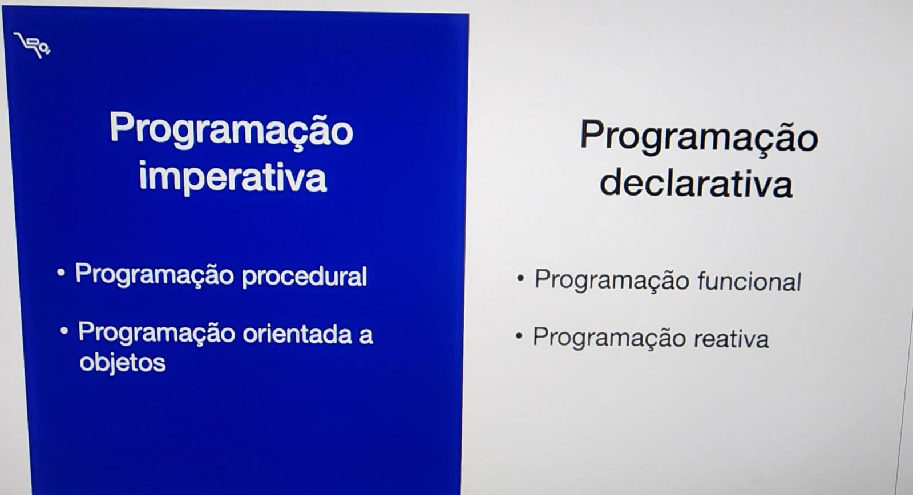

Esses acima são os principais e mais conhecidos.  
A maioria das linguagens de programação suportam vários paradigmas de programação.  
O Java mesmo é possível usar todos esses acima.
 

### - Programação procedural:
- Especifica os passos que um programa deve seguir para alcançar um resultado desejado.
- Instruções passo a passo, executadas em uma ordem de cima pra baixo.
- Tem suporte a procedimentos (funções/sub-rotinas) que podem ser chamados a qualquer hora.
- Procedimentos resolvem partes pequenas do problema.
- Trabalham com dados por meio de variáveis locais ou globais.
- Java usa conceitos do procedural. Todos os exemplos antes do curso foram assim.
- Ele é mais fácil de aprender primeiro.
- Em projetos maiores, é mais suscetível a erros, porque precisa usar muitas variáveis globais e dá muito trabalho de manutenção e confusão.
- Complicado em representar coisas do mundo real em procedural.

Para ajudar a resolver esse problema, temos o POO.  
Ajuda a definir coisas do mundo real ou abstrato do mundo real.  
Exemplo: sonho de ter um veículo → conceito abstrato.  
Mas se falar que o veículo é uma BMW X6, agora passou a ser concreto.

Todos esses conceitos podem ser programados com POO.  
A POO permite criar programas componentizados, fazendo com que tudo se comunique entre si.  
No final das contas tudo é um objeto, e tudo isso se comunica por meio de mensagens e chamadas entre eles.

### - Programação funcional:
- Programação declarativa.
- Apenas declara a lógica do processamento para saber as coisas desejadas sem declarar tudo passo a passo.
- Funciona como fórmula matemática.
- Tem entrada e saída.
- Java tem suporte a ele também.

### - Programação reativa:
- Está sendo mais conhecida agora e Java também tem suporte a ela.
- Estilo declarativo com foco em desenvolvimento de códigos assíncronos e não bloqueantes.
- Programar para dar mais escalabilidade para que os programas processem mais coisas com melhores recursos computacionais.

---

## b) UML - Unified Modeling Language

Linguagem de modelagem unificada.  
Serve para modelar, unificar e documentar projetos.  
É composta por diversos tipos de diagramas (classes, sequências, casos de uso, etc).

> Use só se agregar valor. Não perca tempo com coisa que não precisa.

Criando diagrama de classe:
(ferramenta para usar:)

- Primeiro compartimento: nome da classe
- Segundo compartimento: atributos da classe
- Terceiro compartimento: comportamentos (métodos)

  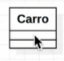

---

## c) Instância
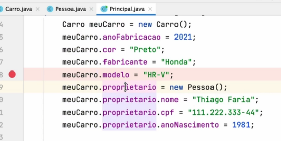
---

## d) O objeto é sempre o mesmo

As variáveis só fazem referência ao objeto.

---

## e) Debug

- **Step Into (F7)**: entra dentro do método:
- 
  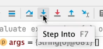
  

- **Step Over (F8)**: executa a linha sem entrar nos detalhes do método:

  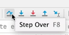
  

- **Step Out (Alt + F8)**: executa tudo do método e volta onde estava antes:

  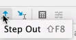

- Entrou em um método, andou um pouco mas resolveu voltar sem executar o método:  
  → botão direito e `Reset Frame` que volta na instrução anterior

 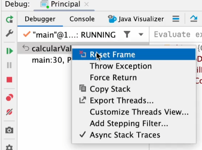

- Se entrar em um método e não quiser continuar o que está sendo executado nele:  
  → botão direito no método e `Force Return`

 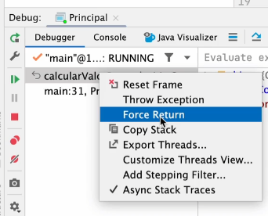

---

## f) Métodos

- Ter métodos **não complexos**. Quebre em pequenas partes.
- Crie métodos que façam pequenas partes e depois chame os métodos.
- Apesar de funcionar dois pontos de saída no método, as boas práticas dizem que um método deve ter um único ponto de saída (um único `return`).
- 
  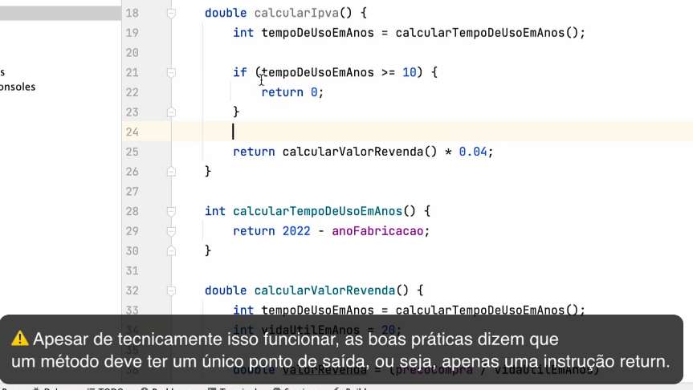
---

## g) Tipo primitivo
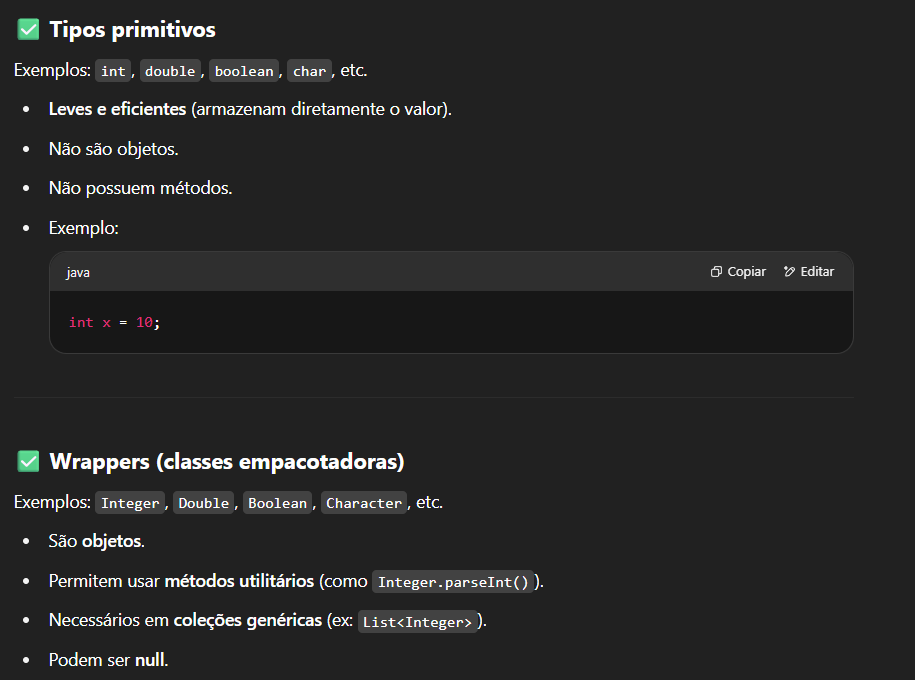
---

## h) Wrapper (classe empacotadora)

É o contrário do tipo primitivo.  
São objetos e possuem métodos. Também podem ser nulos.

---

## i) Modificador `static`

Não é mais uma variável que pertence à instância.  
Ela pertence à própria **classe**.  
É uma variável **compartilhada**. Qualquer lugar que alterar, altera em todos os lugares.

- Exemplo: se eu instancio `Produto` duas vezes (`produto1` e `produto2`) e coloco valores diferentes no `custoEmbalagem`, vai imprimir os mesmos valores.
- 
  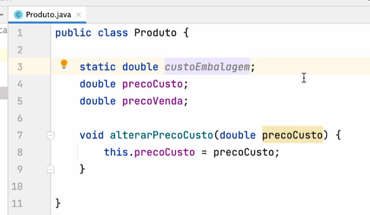
---

## j) Overload (Sobrecarga de métodos)

Mesmos nomes dentro da mesma classe, porém com **assinatura diferente**.
