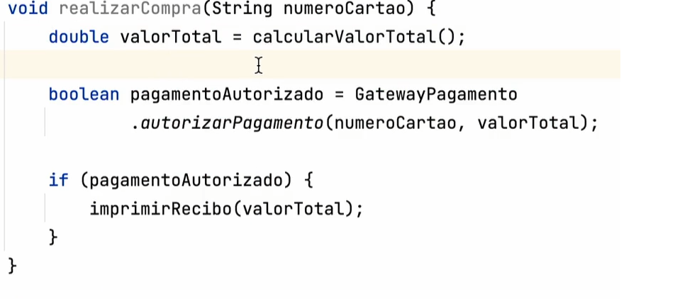
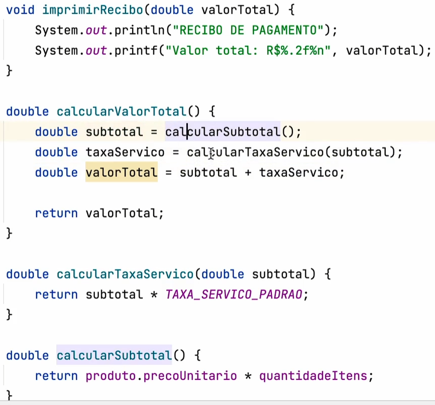
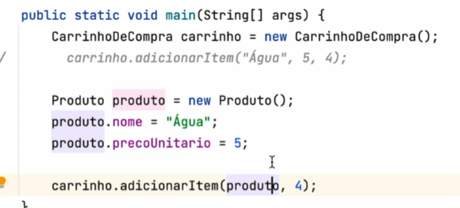
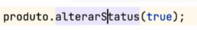
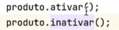
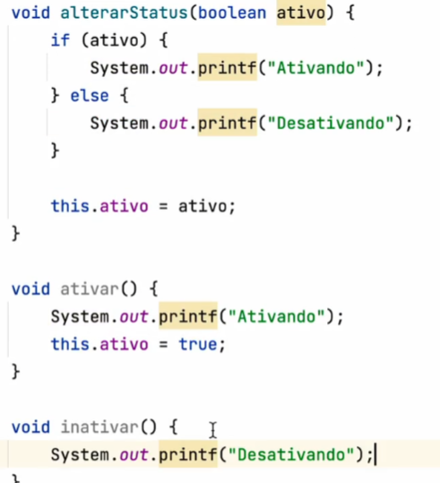
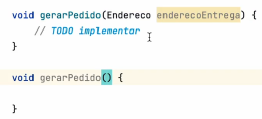
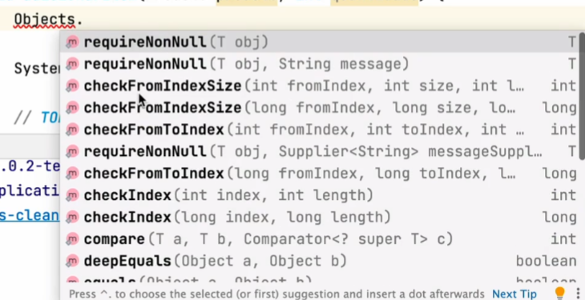
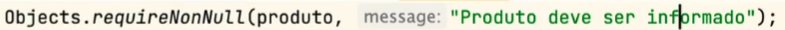

# Boas Práticas com Métodos, Argumentos e Clareza de Código

## a) Bons nomes

Escolher bons nomes, objetivos e claros para variáveis e métodos.

---

## b) Classes pequenas

Classes pequenas, com funções claras.

---

## c) Métodos pequenos e no mesmo nível de abstração

O método abaixo realiza compra, está num nível mais elevado, e está apenas dando ordens. Chamando execuções:

 

Já os métodos abaixo, estão num nível mais baixo com as regras e fazendo coisas objetivas:

 

---

## d) If de uma linha

Em caso de colocar `if` dentro do método, é uma boa prática o `if` ter só uma linha, ou seja, melhor chamar um método.

---

## e) Comentários

Evitar comentários no código.  
Se tem muito comentário, então os nomes não estão bons o suficiente e o código não está claro como deveria.

---

## f) Número de argumentos

O ideal é que um método **não tenha nenhum argumento**.  
Acima de 3, tem algo que pode arrumar e daria pra remover pra ajudar.  
Muitos argumentos dificultam a visibilidade.

 

---

## g) Argumentos de flag (booleanos)

Argumentos de flag **não são muito legais**.  
Exemplo: passar `true` ou `false`, ou até algum número para alternar fluxos.

 

Ao invés disso, é melhor dividir para responsabilidade única e chamar o que quer:

 
-
 

---

## h) Nunca passar `null` como argumento

Nunca passar `null` num argumento de método, porque você precisa ler a implementação do método e entender a lógica pra saber se está correto.

- Sempre verificar se passa `null` ou não.
- Caso seja necessário que possa vir `null`, crie uma sobrecarga que **não recebe nada**.
- Se o método for apenas interno da classe, **pode passar null**.

- Se for método público acessado por outras classes, **melhor não**.

 

Existe uma classe do java chamada Objects que tem várias regras.

 

Fazer tratamento nos métodos que podem ser acessados de fora, como por exemplo, argumentos que podem vir nulos.
