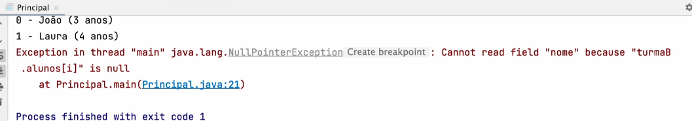
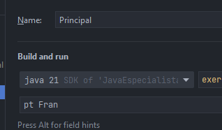

# Arrays e Varargs em Java

## 1) Declaração de Arrays

```java
int[] notas = new int[5];
// ou
int[] notas = {8, 5, 4, 9};
```

## 2) Printando posições do array

Se der `print` em `notas`, vai aparecer algo estranho. Agora se colocar a posição, dá certo:

```java
System.out.println(notas[1]);
```

Dá pra atribuir variável à posição:
```java
notas[0] = 10; // (ou seja, o 8 passará a ser 10)
```

## 3) Percorrendo valores do array

A mais tradicional, usa o controle `for`:

```java
int total = 0;
for(int i = 0; i < notas.length; i++) {
    total = total + notas[i];
}
```

Como vai percorrer do início ao fim, dá pra usar outro `for`:
```java
for(int numero: notas) {
    total = total + numero;
}
```

## 4) Transformando array em string

Às vezes precisa transformar o array em uma `String` pra não dar um resultado esquisito.  
Usar classe `Arrays`:

```java
Arrays.toString(notas);
```

## 5) Ordenando números

O método `sort` altera os valores na ordem correta:

```java
Arrays.sort(notas);
```

Se quiser fazer inverso (decrescente), existe um `Comparator` dentro do próprio `Arrays.sort`, que recebe dois parâmetros. Porém, **só funciona com wrapper**:

```java
Integer[] notas = {8, 5, 4, 9};
Arrays.sort(notas, Comparator.reverseOrder());
```

## 6) Array de objetos

Dá pra criar o objeto e usar ele como array:

```java
Aluno[] alunos;
turmaB.alunos = new Aluno[3];

turmaB.alunos[0] = new Aluno();
turmaB.alunos[0].nome = "Joao";
turmaB.alunos[0].idade = 15;
```

Ou...

```java
Aluno aluno1 = new Aluno();
aluno1.nome = "Felipe";
aluno1.idade = 9;

turmaB.alunos[1] = aluno1;
```

## 7) NullPointer ao iterar

Como está declarado 4 alunos (`0,1,2,3`), mas só 2 estão com valor, caso dê um `for` para imprimir todos os alunos, vai imprimir os dois primeiros e depois quebrar com `NullPointer`.


Dá pra evitar com um `if` ou assim:

```java
for (int i = 0; i < turmaB.alunos.length; i++) {
    if (turmaB.alunos[i] != null) {
        System.out.printf("%s (%d anos)%n", turmaB.alunos[i].nome, turmaB.alunos[i].idade);
    }
}
```

Ou:

```java
void imprimirListaAlunos() {
    for (Aluno aluno : alunos) {
        if (aluno != null) {
            System.out.printf("%s (%d anos)%n", aluno.nome, aluno.idade);
        } else {
            System.out.println("vago");
        }
    }
}
```

## 8) Copiar ou expandir array

```java
int[] numerosJogo1 = {25, 11, 8, 46, 37, 14};
int[] numeroJogo2 = Arrays.copyOf(numerosJogo1, 3); // [25, 11, 8]
```

Se quiser por exemplo aumentar posições (ex: com 7):

```java
int[] numeroJogo2 = Arrays.copyOf(numerosJogo1, 7);
```

## 9) Remover elementos

Não é possível remover diretamente. Arrays têm tamanho fixo. O que dá pra fazer é criar outro array com menos posições.

Exemplo, se quiser criar um array sem o número 8:

```java
int[] numerosJogoNovo = new int[numerosJogoAtual.length - 1];
System.arraycopy(numerosJogoAtual, 0, numerosJogoNovo, 0, 2);
System.arraycopy(numerosJogoAtual, 3, numerosJogoNovo, 2, 4);
```

## 10) ArrayList da Collections API

Trabalhar com arrays pode deixar o código muito burocrático. A API de Collections resolve isso.

```java
ArrayList<String> alunos = new ArrayList<>();
alunos.add("X");
```

ArrayList **não suporta tipos primitivos**. Se quiser, precisa usar wrappers como `Integer`.

## 11) Boas práticas: nunca retorne `null`

Sempre retorne uma instância de coleção, mesmo que vazia.

## 12) Arrays multidimensionais

Array que possui elementos que também são arrays (array de arrays).

```java
String[][] cidades = new String[3][3];
// comporta 9 elementos (3 * 3)
```

## 13) Parâmetros da linha de comando

O `String[] args` recebe sempre os parâmetros passados para o programa.

Exemplo via prompt:
```bash
java Principal pt Fran
// args[0] = "pt", args[1] = "Fran"
```

Exemplo via IDE (Program arguments):




## 14) Métodos com Varargs

Permite aceitar quantidade variável de argumentos.

```java
void pagar(Fatura fatura, String... emailsCobranca) {}
```

Agora pode chamar assim:

```java
servicoCobranca.pagar(fatura, "email1", "email2");
servicoCobranca.pagar(fatura);
```

> Importante: varargs deve ser sempre o **último** argumento do método.

## 15) Boas práticas com Varargs

Como ele aceita múltiplos ou nenhum valor, é importante garantir obrigatórios antes do varargs:

```java
void calcular(Double numero1, Double... demaisNumeros) {
    Objects.requireNonNull(numero1, "obrigatório");
}
```

Assim já quebra no build se esquecer de passar.
