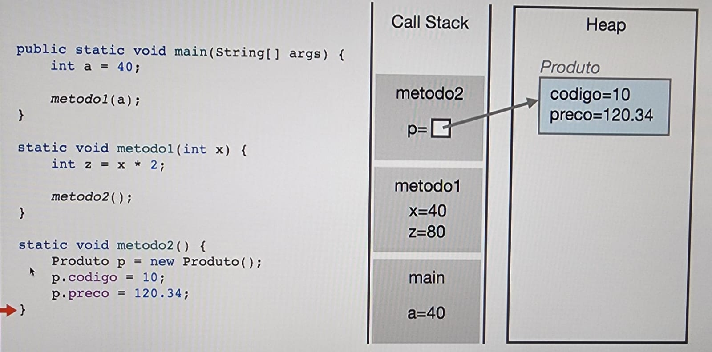

# 1) Estrutura Memória

Todo projeto tem um processamento. Existem algumas ferramentas que mostram, por exemplo no Windows o gerenciador de tarefas mostra a quantidade de memória que está sendo utilizada em cada aplicação.

No caso de aplicações Java, não é diferente. Mesmo aplicações muito pequenas possuem alguns megas a mais, porque nele é carregado não só os argumentos utilizados no projeto, mas tudo que a JVM precisa por trás pra rodar.

Existem duas categorias de memória: memória **heap** e **não heap**.  
Dentro da memória heap, ficam as classes do projeto, tudo que instanciamos com o `new`.  
Na não heap fica todo o resto, inclusive os tipos primitivos que ficam em uma subcategoria chamada **stack memory**.

Podemos iniciar uma aplicação rastreando as memórias por prompt de comando, como por exemplo:

```bash
java -XX:NativeMemoryTracking=summary NomeClasse
```

Depois, enquanto estiver rodando, em outro prompt conseguimos a listagem de todos os processos com:

```bash
j cmd
```

Com a listagem, conseguimos pegar o número que queremos e visualizar especificamente:

```bash
j cmd 8747
```

O comando acima mostrará uma listagem de comandos que podemos dar. Um deles especifica o resumo de gastos da memória do programa, como por exemplo:

```bash
j cmd 8747 VM.native-memory summary
```

---

# 2) Call Stack, Stack Memory, Heap Memory

Quando chamamos métodos e referências, eles vão ficando empilhados em uma **pilha de chamada (call stack)**.

Se existe alguma instância, ela aparece no Call Stack apenas como referência, já que instâncias são alocadas na **Heap** e não na Stack. Depois que os métodos são chamados e retornam para o principal, o **garbage collector** limpa o que não é mais usado na Heap.



---

# 3) Informações da Memória Heap com a Runtime API

Existe uma classe do Java chamada `Runtime`, que é uma API que conseguimos usar para visualizar as memórias utilizadas, não utilizadas e alocadas a nível de código.

A JVM não usa toda a memória disponível do PC. Ela sempre tem um **máximo** que vai/pode utilizar, como se não tivesse permissão para usar mais do que isso.

### Consultar o valor máximo de memória:
```java
Runtime.getRuntime().maxMemory();
```

O valor retornado estará em **bytes**.  
Para converter para **kbytes**, divida por 1024.  
Para converter para **megabytes**, divida novamente por 1024.

### Ver a quantidade de memória já utilizada:
```java
Runtime.getRuntime().totalMemory();
```

Essa é a memória reservada, não significa que tudo já está em uso na heap.

### Ver a quantidade de memória ainda disponível:
```java
Runtime.getRuntime().freeMemory();
```

### Para saber a memória realmente utilizada:
```java
totalMemory() - freeMemory()
```

---

## 4) Configurando a Memória Heap da JVM.
   JVM por padrão tem o limite máximo automático de memória e podemos definir isso tanto via prompt tanto via configuração do intellij.

    - Definir outro limite máximo:
      java -Xmx2G NomeClasse
      2 = 2 unidade de medida
      G = gigabyte
      ou
      java -Xmx900M NomeClasse
      900 = unidade de medida
      M = megabite
      Quando usar? -> Ou quando quer limitar porque está achaando muito, ou quando quer expandir.

   Pela config do intellij da classe principal, add Vm Options, e setar direto lá -Xmx5G

    - E a reserva inicial? Também dá pra alterar.
      java -Xms400M NomeClasse
      ou seja... logo quando incia, já reserva mesmo sem utilizar. Útil quando requer mais memória do que o valor inicial padrão. Dá pra ser usado com o -Xmx junto.

      Sempre que precisa de mais memória, a JVM sempre vai recorrer primeiro ao Garbage Collector para tentar livrar memória Heap, mas isso também é custoso. Por isso faz sentido, as vezes configurar mais.

## 5) Garbage Collector
   O coletor de lixo da JVM recolhe objetos que não estão mais sendo usados e não tem mais referência.
   Vantagem é que roda automaticamente, diferente de algumas linguagens que tem que ser limpado manualmente.

   Não roda o tempo todo pois é custoso pro computador, e não tem uma maneira de chamar especificamente. Porém existe como você tentar sugerir no código para ele passar com:
   System.gc();


## 6) Inalcançabilidade de objetos
   Garbage collector só varre objetos inalcançáveis da memória heap. Existe uma situação onde um objeto pode referenciar a outro dentro da heap, mas perdeu a conexão de fora com a variável guardada no Call Stack. Esse caso é chamado de ilha de isolamento, e o garbage collector é inteligente o suficiente para enxergar que mesmo referenciando um ao outro, eles se tornaram inalcansaveis e aptos a serem coletados.


## 7) Quando esgota a Memória Heap: OutOfMemoryError
   A partir de um teste de estresse instanciando diversos objetos na memória heap, observa-se o erro de OutOfMemoryError. Se algum momento der esse erro, significa que está sendo usado mais memória do que tem alocado. Por isso é importante tomar cuidado com memory leak, que seria objetos que estão sendo instanciados porém nunca usados no código.

## 8) Boas práticas: remova referências de objetos não usados
   Memory leak -> Vazamento de memória -> objetos retidos na memória heap não intencionais.

   Quando uma classe gerencia a sua própria memória, existe necessidade de lembrar de atribuir objetos 'excluídos' como null, pois do contrário continua uma referencia que impede o garbage collector de coletá-los, gerando futuramente erro OutOfMemoryError

## 5) Garbage Collector

O coletor de lixo da JVM recolhe objetos que não estão mais sendo usados e não tem mais referência.  
**Vantagem** é que roda automaticamente, diferente de algumas linguagens que tem que ser limpado manualmente.

Não roda o tempo todo pois é custoso pro computador, e não tem uma maneira de chamar especificamente.  
Porém existe como você tentar sugerir no código para ele passar com:
```java
System.gc();
```

---

## 6) Inalcançabilidade de objetos

Garbage collector só varre objetos inalcançáveis da memória heap.  
Existe uma situação onde um objeto pode referenciar a outro dentro da heap, mas perdeu a conexão de fora com a variável guardada no Call Stack.  
Esse caso é chamado de **ilha de isolamento**, e o garbage collector é inteligente o suficiente para enxergar que mesmo referenciando um ao outro, eles se tornaram inalcançáveis e aptos a serem coletados.

---

## 7) Quando esgota a Memória Heap: OutOfMemoryError

A partir de um teste de estresse instanciando diversos objetos na memória heap, observa-se o erro de `OutOfMemoryError`.  
Se algum momento der esse erro, significa que está sendo usado mais memória do que tem alocado.

Por isso é importante tomar cuidado com **memory leak**, que seria objetos que estão sendo instanciados porém nunca usados no código.

---

## 8) Boas práticas: remova referências de objetos não usados

**Memory leak** -> Vazamento de memória -> objetos retidos na memória heap não intencionais.

Quando uma classe gerencia a sua própria memória, existe necessidade de lembrar de atribuir objetos 'excluídos' como `null`, pois do contrário continua uma referência que impede o garbage collector de coletá-los, gerando futuramente erro `OutOfMemoryError`.
