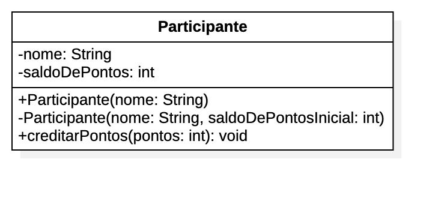

O desenvolvedor sênior avaliou o seu código e pediu para que você fizesse algumas melhorias:

Especificar os modificadores de acesso nos membros da classe Participante
Implementar um método creditarPontos, que soma a quantidade de pontos recebida como argumento no saldo
Veja os detalhes no diagrama de classes que ele te enviou:

Depois que implementar, note o que deixou de funcionar na classe Principal.